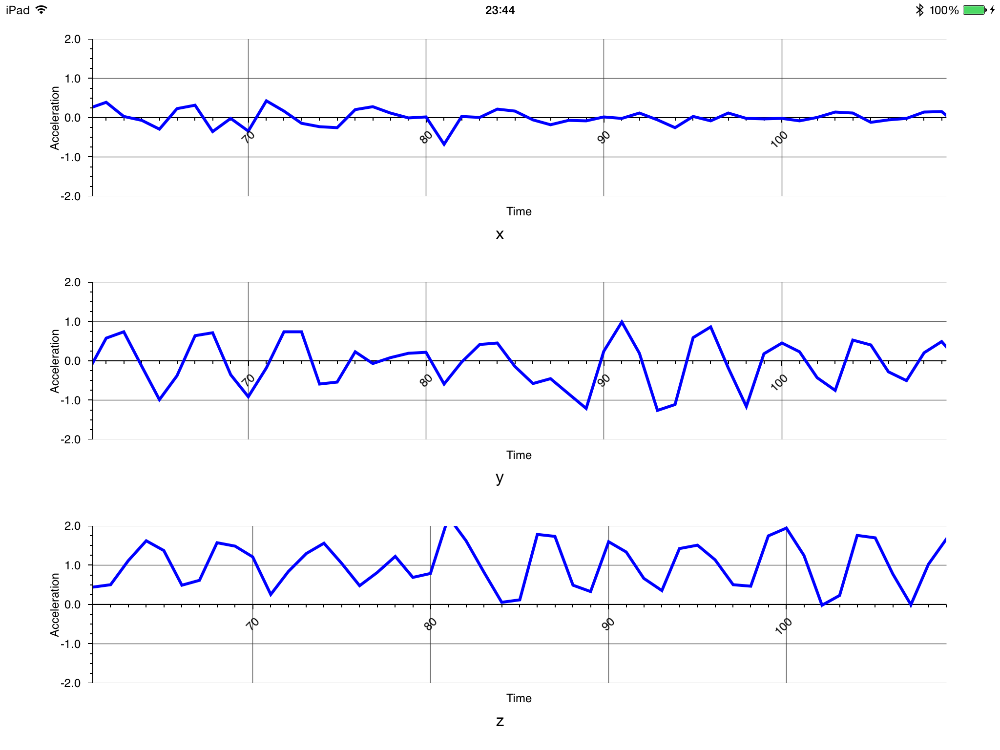

# Accelerometer demo

This project demos a bluetooth LE Accelerometer on Bluegiga's DKBLE development kit connected to an iOS App to graph the values.

## Setup

Use Git to check out the project and its submodule:

	git clone --recursive git@github.com:nrbrook/AccelerometerDemo.git

Use Bluegiga's Software update utility to program the DKBLE.  Make sure the Accelerometer power switch is enabled on the DKBLE.

Open Accelerometer.xcodeproj in Xcode and run on a Bluetooth LE enabled device.
